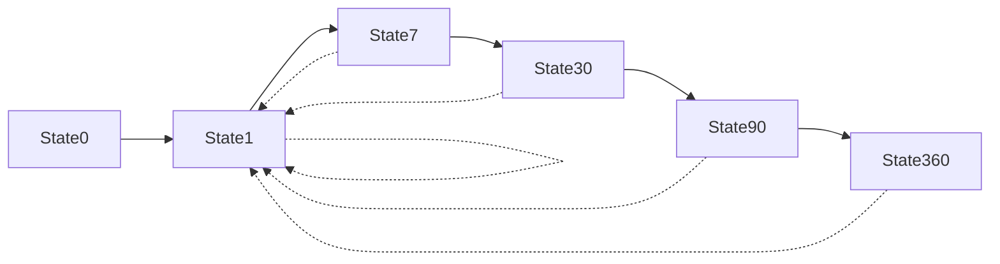
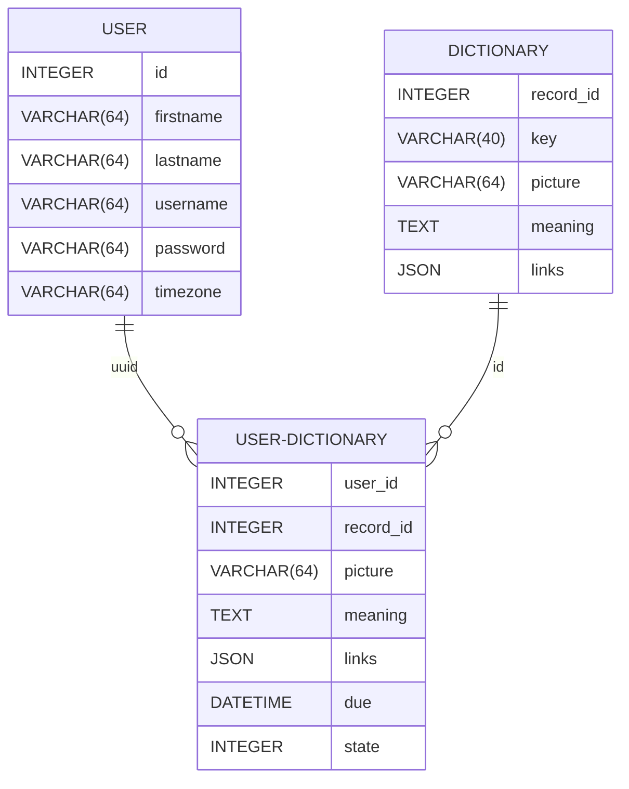

# LexiCycle

“Lexi” represents language and words, while “Cycle” alludes to the cyclical process of memory retention. Just like the natural rhythm of forgetting and remembering, _LexiCycle_ optimizes your vocabulary learning journey. It leverages the spacing effect — gradually increasing intervals for review — to ensure words stick in your long-term memory. See more on [Space repetition](https://en.wikipedia.org/wiki/Spaced_repetition) page.

## Intro

I am a language learner and I watch tons of educational videos, read books and articles and participate in conversations. Here and there I come across with new words and phrases that I am unfamiliar with. This is how I came up with a spreadsheet in which I wrote down such words and phrases.

Obviously it doesn't work on a big scale. As soon as the document got hundreds rows in it, it became impossible to work with it. A big deal of automation is required in order to memorize you dictionary properly.

_LexiCycle_ is designed to solve such chellenges. This tool allows you to create unlimited dictionary and apply _Space repetition_ technique to memerize the best way.

## Features

### Import and export

It is nice to have a common document format in order to exchange vocabulary between different applications. This how I can easily switch from one to another which makes the competition more fair.

### Links to external resources

A vocabulary isn't about words only. It is also about the context, about usage practices and pronounciation. This is why it is vital to have links on the original word source (where you heard it the first time), [Youglish](https://youglish.com/), [Cambrige dictionary](https://dictionary.cambridge.org/us/), etc.

### Spaced Repetition technique

Newly introduced and more difficult words are shown more frequently, while older and less difficult words are shown less frequently in order to exploit the psychological spacing effect.

## States

Each _Record_ can move through a number of predefined states. It can move either forward or backward depending on the check result.

 Each of the _States_ represents the amount of days after which the record will be offered for studying again. If

## Implementation detail

### Database schema

## Terminology

* Dictionary - a knowledge storage which contains _Items_
* Record - a unique pair of _Key_ + _Meaning_ from the _Dictionary_
* Key - a single _Record_ identifier; might be either a word or a phrase.
* Meaning - detailed description of an appropriate _Key_

## Analogs

* [Anki](https://github.com/ankitects/anki)
* [LinguaLeo](https://lingualeo.com/en)
* [Duolingo](https://www.duolingo.com/)
* [Memcode](https://github.com/lakesare/memcode)